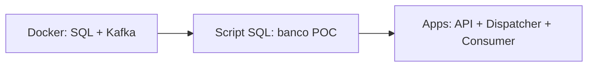
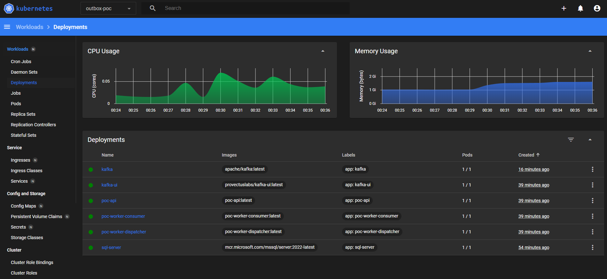
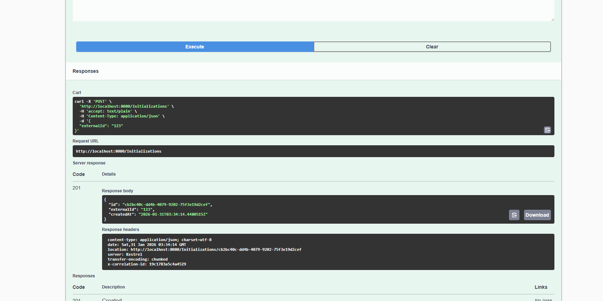
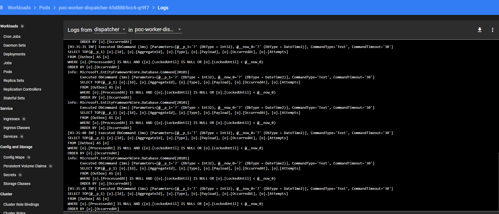
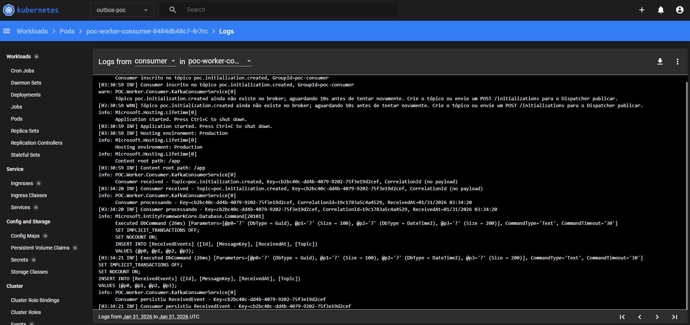
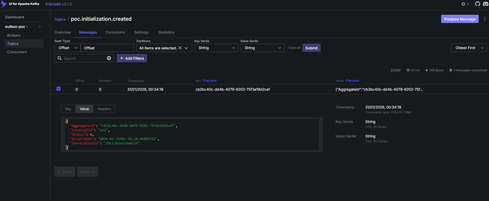

# POC Transactional Outbox — .NET 8, SQL Server, Kafka, Kubernetes

POC didática para o padrão **Transactional Outbox** com **Arquitetura Hexagonal**, pronta para estudo e subida no GitHub.

## Objetivo

1. **API** recebe `POST /initializations`, valida, cria o aggregate **Initialization** e persiste no SQL Server.
2. Na **mesma transação**, insere um registro na tabela **Outbox** (payload JSON do evento).
3. Um **Worker Dispatcher** lê a Outbox em lote, publica no Kafka e marca o registro como processado (`ProcessedAt`).
4. Um **Worker Consumer** escuta o tópico Kafka, processa (log + opcional persistência em `ReceivedEvents`) e faz commit.
5. Tudo roda local com **Kubernetes (k3d)** "dentro do Docker", com opção de **debug com breakpoints** (API + Dispatcher + Consumer).

## Estrutura da Solution (Arquitetura Hexagonal)

```
OutboxKfk/
├── src/
│   ├── POC.Domain/           # Núcleo: entidades, eventos, regras
│   │   ├── Entities/         # Initialization (aggregate)
│   │   └── Events/           # InitializationCreatedEvent
│   ├── POC.Application/      # Casos de uso: Commands, Handlers, Portas (interfaces)
│   │   ├── Commands/
│   │   ├── Handlers/
│   │   └── Ports/            # IInitializationRepository, IOutboxWriter, IOutboxRepository, IMessagePublisher, IUnitOfWork, IReceivedEventStore
│   ├── POC.Infra/            # Adapters: EF Core, Kafka, Migrations
│   │   ├── Persistence/      # AppDbContext, repositórios, Outbox, ReceivedEvents
│   │   └── Kafka/            # KafkaProducer, KafkaOptions
│   ├── POC.Api/              # Host HTTP: controllers, middleware (CorrelationId), Serilog
│   ├── POC.Worker.Dispatcher/# Host Worker: lê Outbox, publica Kafka, lock otimista
│   └── POC.Worker.Consumer/  # Host Worker: consome Kafka, log + ReceivedEvents
├── deploy/
│   ├── k8s/                  # Manifests: namespace, ConfigMap, SQL Server, Kafka, API, Workers
│   └── k3d/                  # Scripts para criar cluster k3d e deploy
├── docker/                   # Dockerfiles por app (Api, Worker.Dispatcher, Worker.Consumer)
└── README.md
```

- **Domain**: sem dependências externas; entidades e eventos de domínio.
- **Application**: depende só do Domain; define portas (interfaces); não conhece Infra.
- **Infra**: implementa portas (EF Core, Kafka); referência Application e Domain.
- **Api / Workers**: hosts que registram DI (Application + Infra) e expõem endpoints ou background services.

## Modelo de Dados (mínimo)

| Tabela           | Campos principais                                                                 |
|------------------|-------------------------------------------------------------------------------------|
| **Initializations** | Id (PK), ExternalId, Status, CreatedAt                                          |
| **Outbox**       | Id (PK), AggregateId, Type, Payload (JSON), OccurredAt, ProcessedAt, Attempts, LockedUntil, LockId, LastError |
| **ReceivedEvents** | Id (PK), MessageKey, Topic, ReceivedAt (opcional, auditoria)                    |

A gravação da entidade de domínio e do registro na Outbox ocorre na **mesma transação** (mesmo `DbContext.SaveChangesAsync`).

## Pré-requisitos

- **.NET 8 SDK**
- **Docker Desktop** (para SQL Server, Kafka e k3d)
- **k3d** — Kubernetes "dentro do Docker". No Windows com [Chocolatey](https://chocolatey.org/): `choco install k3d`. Outras formas: [instalação oficial](https://k3d.io/v5.x/docs/usage/install/).
- **kubectl** (geralmente instalado junto com o k3d pelo Chocolatey; ou `choco install kubernetes-cli`)

## Passo a passo de execução

A ordem correta é: **1) Docker (infra)** → **2) Script SQL (banco e tabelas)** → **3) Aplicações (API + Dispatcher + Consumer)**. Rodar as apps antes de criar o banco gera erro de conexão ou "Invalid object name 'Outbox'".

### Resumo da ordem

| Ordem | O quê | Por quê |
|-------|--------|---------|
| **1** | Subir **Docker** (SQL Server + Kafka) | A base e o broker precisam estar de pé antes de qualquer app. |
| **2** | Executar o **script SQL** na mão | Cria o banco `POC` e as tabelas (Initializations, Outbox, ReceivedEvents). A API não cria o banco sozinha; o script é obrigatório. |
| **3** | Rodar as **aplicações** (API, Dispatcher, Consumer) | Com a base criada, use **inicialização múltipla** no Visual Studio (F5) ou três terminais com `dotnet run`. Funciona bem para estudo e debug. |

Fluxo de execução (visão geral):



---

### 1) Rodar a infra local (SQL Server + Kafka) via Docker

**Primeiro passo:** subir apenas a infraestrutura. Útil para desenvolvimento e debug com breakpoints.

**Opção A — docker-compose (recomendado; inclui Kafka UI):**

```powershell
docker-compose -f docker-compose.infra.yml up -d
```

**Opção B — containers avulsos:**

```powershell
# SQL Server
docker run -d --name sql-server -e "ACCEPT_EULA=Y" -e "MSSQL_SA_PASSWORD=YourStrong!Passw0rd" -p 1433:1433 mcr.microsoft.com/mssql/server:2022-latest

# Kafka (confluentinc/cp-kafka com Zookeeper)
docker run -d --name zookeeper -p 2181:2181 confluentinc/cp-zookeeper:7.5.0 -c "zookeeper"
docker run -d --name kafka -p 9092:9092 --link zookeeper -e KAFKA_ZOOKEEPER_CONNECT=zookeeper:2181 -e KAFKA_ADVERTISED_LISTENERS=PLAINTEXT://localhost:9092 confluentinc/cp-kafka:7.5.0
```

Aguarde os containers ficarem *healthy* antes de seguir. Com docker-compose, o serviço **kafka-create-topic** já cria o tópico `poc.initialization.created`. Mais detalhes em [Docker Compose](#docker-compose-opcional).

---

### 2) Criar o banco POC e as tabelas (obrigatório antes de rodar API/Dispatcher/Consumer)

**Segundo passo:** com o SQL Server no ar, execute o script **uma vez** para criar o banco e as tabelas. Sem isso, a API falha com "Cannot open database 'POC'" ou "Invalid object name 'Outbox'".

Script: **`scripts/create-database-and-tables.sql`**

**Com sqlcmd:**

```powershell
sqlcmd -S localhost,1433 -U sa -P YourStrong!Passw0rd -i scripts/create-database-and-tables.sql -C
```

**Ou** abra o arquivo no **SSMS** ou **Azure Data Studio**, conecte no SQL Server (localhost,1433) e execute.

---

### 3) Rodar as aplicações (inicialização múltipla no Visual Studio funciona bem)

**Terceiro passo:** com Docker e banco prontos, suba as três aplicações. O modo mais prático para estudo e debug é **Multiple Startup Projects** no Visual Studio.

**Opção recomendada — Visual Studio (inicialização múltipla):**

1. Abra a solution `OutboxKfk.sln` no Visual Studio.
2. Clique com o botão direito na solution → **Properties** → **Startup Project** → **Multiple startup projects**.
3. Selecione **Start** para: **POC.Api**, **POC.Worker.Dispatcher**, **POC.Worker.Consumer** (nesta ordem, se possível).
4. Pressione **F5**. Os três projetos sobem e você pode colocar breakpoints na API (controller/handler), no Dispatcher (OutboxDispatcherService) e no Consumer (KafkaConsumerService).

**Opção alternativa — terminais (PowerShell):**

```powershell
cd c:\Users\HOME\Desktop\OutboxKfk
dotnet restore
dotnet build

# Terminal 1 — API
dotnet run --project src/POC.Api

# Terminal 2 — Worker Dispatcher
dotnet run --project src/POC.Worker.Dispatcher

# Terminal 3 — Worker Consumer
dotnet run --project src/POC.Worker.Consumer
```

### 4) Testar o fluxo

A API sobe em **http://localhost:5000** (veja `src/POC.Api/Properties/launchSettings.json`). Swagger: http://localhost:5000/swagger

```powershell
# POST Inicialização (gera aggregate + registro na Outbox na mesma transação)
Invoke-RestMethod -Method Post -Uri "http://localhost:5000/initializations" -ContentType "application/json" -Body '{"externalId":"EXT-001"}'

# Ou com curl (bash)
curl -X POST http://localhost:5000/initializations -H "Content-Type: application/json" -d "{\"externalId\":\"EXT-001\"}"
```

Fluxo esperado nos logs:

1. **API**: "Initialization criada - Id=..., CorrelationId=..., persist+outbox na mesma transação"
2. **Dispatcher**: "Dispatcher processando lote...", "Dispatcher publicando Outbox Id=...", "Dispatcher marcou Outbox Id=... como ProcessedAt"
3. **Consumer**: "Consumer received - Topic=..., Key=...", "Consumer processando - Key=..., CorrelationId=...", "Consumer persistiu ReceivedEvent"

### 5) Rodar tudo no Kubernetes (k3d)



**Checklist subida (proxima vez):** 1) `.\deploy\k3d\up.ps1` → 2) quando pausar, `.\scripts\run-sql-in-k8s.ps1` → 3) Enter → 4) API em http://localhost:28080. SSMS: port-forward SQL e conecte em **127.0.0.1,21433**.

**Subir de imediato (recomendado):** na **raiz do repositório**, no PowerShell:

```powershell
cd C:\Users\HOME\Desktop\OutboxKfk   # ou o caminho do seu clone
.\deploy\k3d\up.ps1
```

O script:

1. Cria o cluster k3d (API na porta **28080**).
2. Aplica namespace, ConfigMap, SQL Server (com mssql.conf para aceitar conexões) e Kafka (Apache KRaft).
3. Aguarda SQL e Kafka ficarem Ready (até 10 min).
4. **Pausa** e pede para você rodar o script SQL **uma vez** (recomendado: `.\scripts\run-sql-in-k8s.ps1` — não precisa de port-forward).
5. Após Enter: build das imagens, import no k3d, deploy da API e dos Workers.
6. Opcional: Kafka UI e Kubernetes Dashboard.

**Criar o banco POC (obrigatório):** use o script que roda dentro do pod (mais simples):

```powershell
.\scripts\run-sql-in-k8s.ps1
```

**Visualizar tabelas no SSMS/Azure Data Studio:** use **127.0.0.1,21433** (não localhost,1433). Em um terminal deixe o port-forward rodando e conecte no SSMS:

```powershell
kubectl port-forward svc/sql-server 21433:1433 -n outbox-poc
```

No SSMS: servidor **127.0.0.1,21433**, autenticação SQL, usuário **sa**, senha **YourStrong!Passw0rd**. Marque "Confiar no certificado do servidor" em Propriedades da Conexão se pedir.

**Guia dinâmico (portas + comandos + script da base):** para ver o passo a passo completo com port-forwards, URLs no navegador e comando do script SQL, rode na raiz do repo:

```powershell
.\scripts\access-guide.ps1
```

As portas vêm de **`deploy/k3d/config.ps1`** (fonte única); altere lá para mudar em todos os scripts.

**Tabela de portas (host) — valores padrão em config.ps1:**

| Serviço        | Porta no host | Acesso |
|----------------|---------------|--------|
| API / Swagger  | **28080**     | http://localhost:28080 e http://localhost:28080/swagger |
| SQL Server     | **21433**     | 127.0.0.1,21433 (com port-forward) |
| Kafka          | 9092          | port-forward: `kubectl port-forward svc/kafka 9092:9092 -n outbox-poc` |
| Kafka UI       | 8081          | port-forward: `kubectl port-forward svc/kafka-ui 8081:8080 -n outbox-poc` → http://localhost:8081 |
| K8s Dashboard  | 8443          | port-forward: `kubectl port-forward -n kubernetes-dashboard svc/kubernetes-dashboard 8443:443` → https://localhost:8443 |

No final, teste a API:

```powershell
Invoke-RestMethod -Method Post -Uri "http://localhost:28080/initializations" -ContentType "application/json" -Body '{"externalId":"EXT-K8S-001"}'
```

#### Passo a passo das portas (expor e acessar no navegador + script da base)

Tudo em um lugar, **dinâmico** (raiz do repo e portas vêm de `deploy/k3d/config.ps1`):

```powershell
.\scripts\access-guide.ps1
```

O script imprime: 1) comandos de port-forward (SQL, API, Kafka, Kafka UI, Dashboard); 2) comando para criar o banco (`run-sql-in-k8s.ps1`); 3) URLs no navegador (API, Swagger, Kafka UI, Dashboard); 4) dados para SSMS (127.0.0.1,21433); 5) sqlcmd opcional. Para mudar portas, edite **`deploy/k3d/config.ps1`** — o `up.ps1` e o `access-guide.ps1` usam esse arquivo.

Se preferir **passo a passo manual**, siga os itens abaixo.

---

#### SQL no Kubernetes — particularidades

1. **Criar banco (recomendado):** rode `.\scripts\run-sql-in-k8s.ps1` na raiz do repo. Não precisa de port-forward; o script executa o SQL dentro do pod. Rode de novo se reiniciar o deployment do SQL (dados são efêmeros sem PersistentVolume).

2. **Visualizar tabelas no SSMS/Azure Data Studio:** use **127.0.0.1,21433** (evite só "localhost" se der conexão recusada). Em um terminal: `kubectl port-forward svc/sql-server 21433:1433 -n outbox-poc`. No SSMS: servidor **127.0.0.1,21433**, autenticação SQL, **sa** / **YourStrong!Passw0rd**. Em Propriedades da Conexão, marque "Confiar no certificado do servidor".

3. **sqlcmd no host (alternativa ao script):** com o port-forward ativo: `sqlcmd -S 127.0.0.1,21433 -U sa -P YourStrong!Passw0rd -i scripts/create-database-and-tables.sql -C` (use **-S** maiúsculo).

4. **Memória:** SQL Server em Linux exige pelo menos 2 GB. O manifest já está com 2Gi. Se o pod não ficar Ready, reaplique: `kubectl apply -f deploy/k8s/sql-server.yaml` e `kubectl rollout restart deployment/sql-server -n outbox-poc`.

5. **Testar porta:** `Test-NetConnection -ComputerName 127.0.0.1 -Port 21433` (TcpTestSucceeded = True). Logs: `kubectl logs -n outbox-poc deployment/sql-server --tail=80`.

---

#### 4.1 Criar o cluster k3d

```powershell
# Windows (PowerShell)
.\deploy\k3d\cluster-create.ps1

# Linux/macOS
chmod +x deploy/k3d/cluster-create.sh
./deploy/k3d/cluster-create.sh
```

#### 4.2 Subir infra (SQL Server + Kafka) e aplicações no k8s

```powershell
# Namespace + ConfigMap + SQL Server + Kafka
kubectl apply -f deploy/k8s/namespace.yaml
kubectl apply -f deploy/k8s/configmap.yaml
kubectl apply -f deploy/k8s/sql-server.yaml
kubectl apply -f deploy/k8s/kafka.yaml

# Aguardar SQL e Kafka ficarem Ready (Kafka tem startupProbe; pode levar até ~5 min)
kubectl wait --for=condition=ready pod -l app=sql-server -n outbox-poc --timeout=600s
kubectl wait --for=condition=ready pod -l app=kafka -n outbox-poc --timeout=600s

# Criar banco POC (obrigatório): na raiz do repo
# .\scripts\run-sql-in-k8s.ps1
```

#### 4.3 Build das imagens e import no k3d

```powershell
# Na raiz do repo
.\deploy\k3d\deploy.ps1
```

Ou manualmente:

```powershell
docker build -t poc-api:latest -f docker/POC.Api/Dockerfile .
docker build -t poc-worker-dispatcher:latest -f docker/POC.Worker.Dispatcher/Dockerfile .
docker build -t poc-worker-consumer:latest -f docker/POC.Worker.Consumer/Dockerfile .
k3d image import poc-api:latest poc-worker-dispatcher:latest poc-worker-consumer:latest -c outbox-poc
```

#### 4.4 Deploy da API e dos Workers

```powershell
kubectl apply -f deploy/k8s/api.yaml
kubectl apply -f deploy/k8s/worker-dispatcher.yaml
kubectl apply -f deploy/k8s/worker-consumer.yaml
```

A API fica exposta na porta **28080** do loadbalancer (conforme `cluster-create.ps1`). Exemplo de teste:

```powershell
Invoke-RestMethod -Method Post -Uri "http://localhost:28080/initializations" -ContentType "application/json" -Body '{"externalId":"EXT-K8S-001"}'
```

## Funcionamento e performance de cada componente

### API (POC.Api)



- **Função:** Recebe `POST /initializations`, valida o comando, cria o aggregate **Initialization** e persiste no SQL Server. Na **mesma transação**, insere um registro na tabela **Outbox** com o payload JSON do evento.
- **Performance:** Cada request faz uma única transação SQL (INSERT em Initializations + INSERT em Outbox). A latência depende do round-trip ao SQL Server; tipicamente dezenas de milissegundos. Não publica direto no Kafka — o Dispatcher é quem faz isso de forma assíncrona, evitando acoplamento e falhas de rede no request.
- **Observabilidade:** Serilog com CorrelationId (header `X-Correlation-Id`); o mesmo ID é gravado no payload da Outbox para rastreio ponta a ponta.

### Worker Dispatcher (POC.Worker.Dispatcher)



- **Função:** Em loop, consulta a tabela **Outbox** em lote (registros com `ProcessedAt` nulo e lock liberado), aplica **lock otimista** (LockedUntil, LockId), publica cada registro no Kafka (tópico `poc.initialization.created`) e, em caso de sucesso, marca `ProcessedAt`. Em falha, incrementa `Attempts`, grava `LastError` e libera o lock para retry posterior.
- **Performance:** Poll configurável (`Dispatcher:PollIntervalSeconds`). O tamanho do lote e o intervalo definem throughput e atraso. Um único Dispatcher processa centenas a milhares de eventos por minuto conforme capacidade do Kafka e do SQL. Vários replicas podem rodar em paralelo (lock otimista evita processar o mesmo registro duas vezes).
- **Observabilidade:** Logs por lote e por publicação; erros não derrubam o worker — o ciclo continua no próximo poll.

### Worker Consumer (POC.Worker.Consumer)



- **Função:** Inscreve-se no tópico **poc.initialization.created** (consumer group `poc-consumer`), consome mensagens, loga e opcionalmente persiste em **ReceivedEvents** para auditoria.
- **Performance:** Consumo em tempo real; throughput limitado pelo Kafka e pelo commit do consumer. Escala horizontalmente aumentando partições do tópico e instâncias no mesmo consumer group.
- **Observabilidade:** Logs por mensagem recebida com Key e CorrelationId; persistência em ReceivedEvents permite conferir o que foi processado.

### SQL Server

- **Função:** Persistência transacional do aggregate (Initializations), da Outbox e de ReceivedEvents. A **mesma transação** na API garante consistência entre domínio e Outbox.
- **Performance:** Índices em Outbox (por ProcessedAt, LockedUntil) são importantes para o Dispatcher. Transações curtas e bem indexadas mantêm latência baixa.

### Kafka



- **Função:** Barramento de eventos. O Dispatcher publica; o Consumer consome. Tópico único nesta POC: **poc.initialization.created**.
- **Performance:** Alta throughput e retenção configurável. Producer com acks e idempotência reduz duplicatas; consumer com commit após processamento garante at-least-once.

### Padrão Transactional Outbox (resumo)

- **Objetivo:** Garantir que o evento seja publicado **eventualmente** se (e somente se) a transação de negócio for commitada, evitando publicar antes de persistir ou perder eventos se o broker cair.
- **Fluxo:** API grava domínio + Outbox na mesma transação → Dispatcher lê Outbox e publica no Kafka → Consumer processa. A Outbox funciona como fila persistida no próprio banco; o Dispatcher é o “relay” entre SQL e Kafka.

## Debug com breakpoints (modo recomendado para estudo)

### Opção A — Infra no Kubernetes, apps .NET no host

1. Crie o cluster k3d e suba apenas **SQL Server + Kafka** no k8s (como acima).
2. Exponha os serviços para o host com **port-forward** (deixe os terminais abertos):
   - SQL: `kubectl port-forward svc/sql-server 21433:1433 -n outbox-poc` → conectar com **127.0.0.1,21433**
   - Kafka: `kubectl port-forward svc/kafka 9092:9092 -n outbox-poc` → conectar com `localhost:9092`
3. Nos `appsettings.json` (ou `appsettings.Development.json`) da API, Dispatcher e Consumer, use:
   - SQL: **`Server=127.0.0.1,21433;...`** (use 127.0.0.1 para evitar "conexão recusada" em alguns ambientes)
   - Kafka: **`BootstrapServers=localhost:9092`** (o host não resolve o DNS `kafka` do cluster; o port-forward evita "Broker: Unknown host" / "NoBrokersAvailable").
4. Rode a **API**, o **Worker.Dispatcher** e o **Worker.Consumer** pelo IDE (F5 / Run com breakpoints).

Assim você consegue debugar API, Dispatcher e Consumer com breakpoints enquanto a infraestrutura roda no k8s.

### Opção B — Tudo no host (SQL + Kafka em containers Docker, apps com `dotnet run`)

1. Suba SQL Server e Kafka em containers (como no passo 1 da seção "Passo a passo").
2. Use `appsettings.json` com `localhost` para SQL e Kafka.
3. Execute `dotnet run` (ou múltiplos projetos no IDE) para API, Dispatcher e Consumer e coloque breakpoints onde precisar.

### Opção C — Tudo no Kubernetes

Rodar todos os manifests (incluindo API e Workers) no k3d. Funciona para simular ambiente, mas **não permite breakpoints** nos pods (a menos que use ferramentas de debug remoto).

## Observabilidade

- **Serilog** com logs estruturados; propriedade **CorrelationId** propagada no request (header `X-Correlation-Id`) e no payload do evento.
- Logs claros em cada etapa: persist + outbox insert (API), dispatcher publish (Worker.Dispatcher), consumer received (Worker.Consumer).

## Regras importantes do Dispatcher

- Poll a cada **X segundos** (configurável: `Dispatcher:PollIntervalSeconds`).
- Busca **N** registros onde `ProcessedAt is null` e `(LockedUntil is null OR LockedUntil < now)`.
- Lock otimista: atualiza `LockedUntil` e `LockId` antes de publicar.
- Publica no Kafka com **key = AggregateId**.
- Sucesso: `ProcessedAt = now`.
- Falha: incrementa `Attempts`, seta `LastError`, libera lock (`LockedUntil`/`LockId` null).
- Erros são tratados para não travar o pod; o ciclo continua no próximo poll.

## Kafka

- Tópico: **poc.initialization.created**
- Consumer group: **poc-consumer**
- Producer com **acks=all** e idempotência quando suportado (`Kafka:ProducerIdempotence`).
- **Listeners vs Advertised:** O broker usa `KAFKA_LISTENERS` (em que interface escuta) e `KAFKA_ADVERTISED_LISTENERS` (endereço que anuncia aos clients). No k8s, o advertised é o DNS do Service (`kafka.outbox-poc.svc.cluster.local:9092`), assim os pods no cluster conectam. **No host** (dotnet run com breakpoints), o Windows não resolve esse DNS → use **port-forward** (`kubectl port-forward svc/kafka 9092:9092 -n outbox-poc`) e **BootstrapServers=localhost:9092** para evitar "Broker: Unknown host" / "NoBrokersAvailable".
- **Local (docker-compose)**: apps no host usam **localhost:29092**; containers (Kafka UI) usam **kafka:9092**. Se aparecer "Connection to localhost:9092 could not be established. Broker may not be available", confira se o Kafka está no ar (`docker ps`) e se o `appsettings.json` usa **BootstrapServers=localhost:29092**.

## Docker Compose (opcional)

O arquivo `docker-compose.infra.yml` na raiz sobe SQL Server, Zookeeper, Kafka e **Kafka UI (Provectus)**:

```powershell
docker-compose -f docker-compose.infra.yml up -d
```

- **Kafka UI (Provectus)**: interface web em **http://localhost:8080** — use para inspecionar tópicos (ex.: `poc.initialization.created`), consumer groups (`poc-consumer`) e mensagens.
- **Não abra** `http://localhost:2181` no navegador: essa é a porta do Zookeeper (protocolo binário). Acessá-la com HTTP gera o erro "Len error" nos logs; a interface correta é a **8080**.
- **Kafka no host**: as apps .NET (API, Dispatcher, Consumer) rodando no host usam **localhost:29092** (porta exposta pelo docker-compose). Dentro do Docker, Kafka UI e kafka-create-topic usam **kafka:9092**. Isso evita o erro "Connection to localhost:9092 could not be established. Broker may not be available" quando a Kafka UI tenta conectar.
- **Tópico `poc.initialization.created`**: o serviço `kafka-create-topic` no docker-compose cria o tópico na subida. Se o Consumer ainda acusar "Unknown topic or partition", crie manualmente: `docker exec -it <container-kafka> kafka-topics --create --topic poc.initialization.created --bootstrap-server kafka:9092 --partitions 1 --replication-factor 1` (dentro do container use `kafka:9092`).

## Kubernetes Dashboard (gestão)

Interface web oficial da Kubernetes para ver pods, deployments, serviços, logs e eventos do cluster. Útil para inspecionar o namespace `outbox-poc` e os recursos da POC.

### Instalação (cluster k3d já criado)

**Opção A — durante o `up.ps1`:** quando o script perguntar "Subir Kubernetes Dashboard? (s/N)", responda **s**. O script aplica o Dashboard e o usuário admin e mostra as instruções de acesso.

**Opção B — manual:**

```powershell
# 1) Dashboard oficial
kubectl apply -f https://raw.githubusercontent.com/kubernetes/dashboard/v2.7.0/aio/deploy/recommended.yaml

# 2) Usuário admin (token para login)
kubectl apply -f deploy/k8s/dashboard-admin.yaml
```

### Acesso

1. **Port-forward** (deixe este terminal aberto):
   ```powershell
   kubectl port-forward -n kubernetes-dashboard svc/kubernetes-dashboard 8443:443
   ```
2. Abra **https://localhost:8443** no navegador e aceite o aviso de certificado (certificado autoassinado).
3. Na tela de login, escolha **Token**.
4. Gere o token e cole no campo:
   ```powershell
   kubectl -n kubernetes-dashboard create token admin-user
   ```
5. Clique em **Sign in**. No menu, selecione o namespace **outbox-poc** para ver os pods da API, Dispatcher, Consumer, SQL Server e Kafka.

## Comandos úteis

| Ação | Comando |
|------|--------|
| **Subir POC inteira no k8s** | `.\deploy\k3d\up.ps1` (na raiz do repo) |
| **Guia portas + acesso + script base** | `.\scripts\access-guide.ps1` (dinâmico; portas em deploy/k3d/config.ps1) |
| **Criar banco POC no k8s** | `.\scripts\run-sql-in-k8s.ps1` |
| **Port-forward SQL (SSMS)** | `kubectl port-forward svc/sql-server 21433:1433 -n outbox-poc` → conectar **127.0.0.1,21433** |
| Compilar | `dotnet build` |
| Rodar API | `dotnet run --project src/POC.Api` |
| Criar cluster k3d | `.\deploy\k3d\cluster-create.ps1` |
| Build + import + deploy apps k8s | `.\deploy\k3d\deploy.ps1` + `kubectl apply -f deploy/k8s/api.yaml -f deploy/k8s/worker-dispatcher.yaml -f deploy/k8s/worker-consumer.yaml` |
| Ver pods | `kubectl get pods -n outbox-poc` |
| Logs API | `kubectl logs -f deployment/poc-api -n outbox-poc` |

## Postman + Docker + Visual Studio (teste local)

- **Collection Postman**: importe `postman/Outbox-POC-API.postman_collection.json` no Postman para testar `POST /initializations` (e variante com ID fixo).
- **Infra no Docker**: `docker-compose -f docker-compose.infra.yml up -d`.
- **Visual Studio**: abra a solution, configure **Multiple startup projects** (API + Worker.Dispatcher + Worker.Consumer) e pressione **F5**. Use breakpoints na API, no Dispatcher e no Consumer.
- Passo a passo detalhado: veja **`postman/README.md`**.

## Documentação

A documentação segue **padrão profissional** e **abordagem de especialista**, com **diagramas em Mermaid** (flowchart, sequenceDiagram, erDiagram) para arquitetura, fluxos e infraestrutura. Detalhes em:

- **[docs/ARQUITETURA-E-INFRA.md](docs/ARQUITETURA-E-INFRA.md)** — Arquitetura hexagonal, Transactional Outbox (sequência), modelo de dados (ER), topologia k8s, ConfigMap, SQL/Kafka e ordem de subida, todos com Mermaid.

## Licença e uso

Projeto de estudo; pode ser usado e adaptado conforme necessidade.
