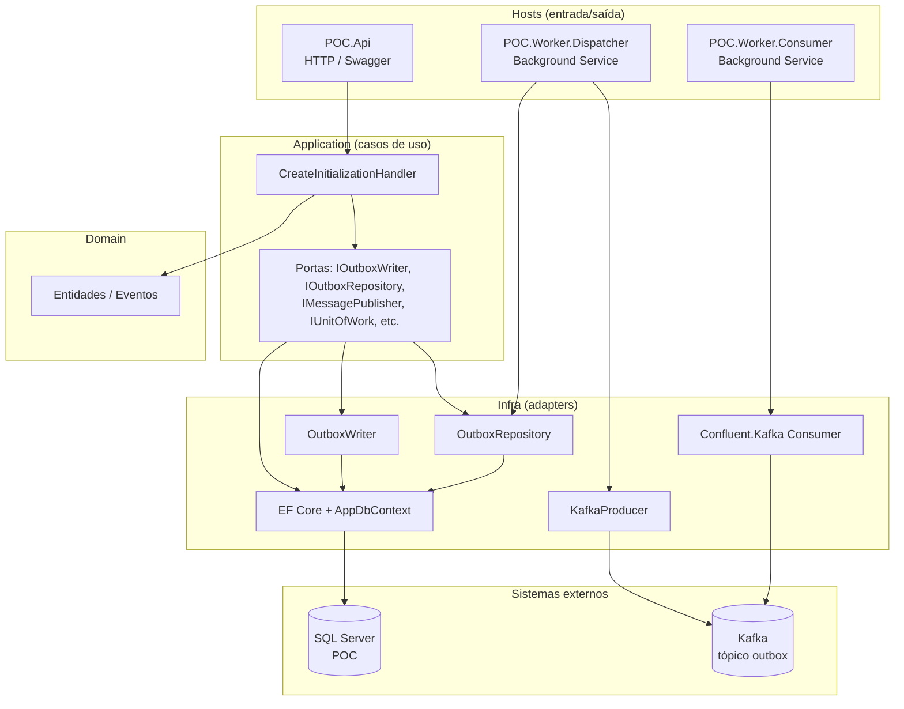
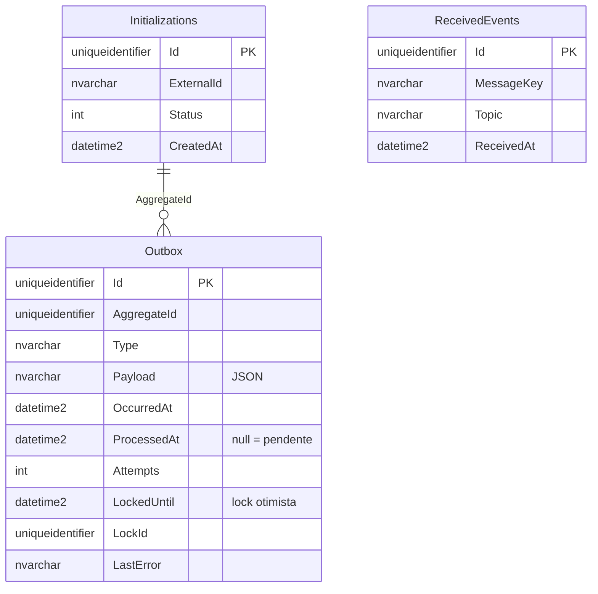
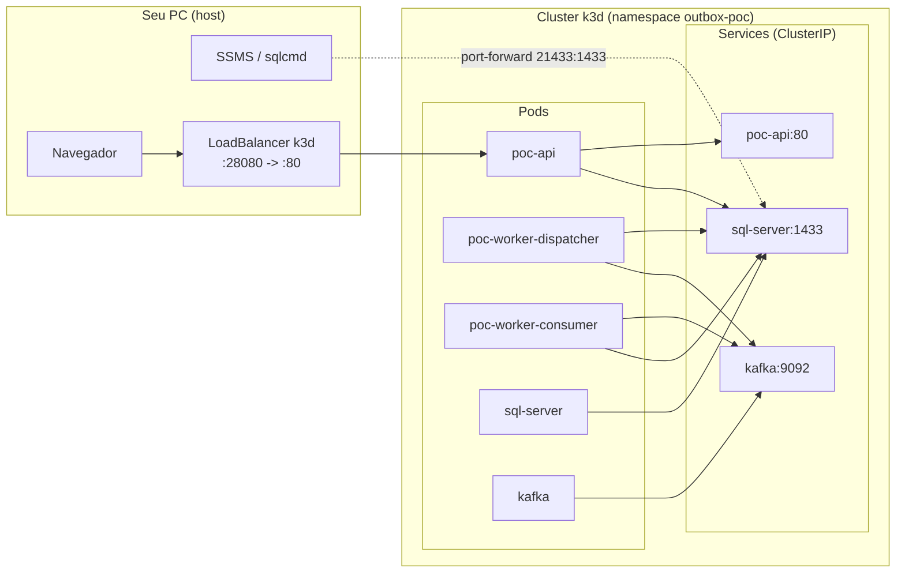
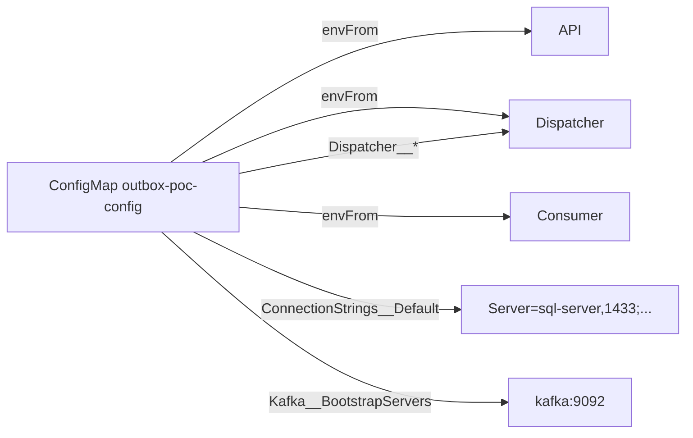
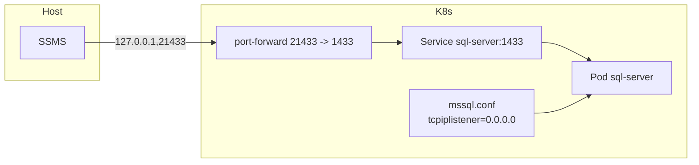
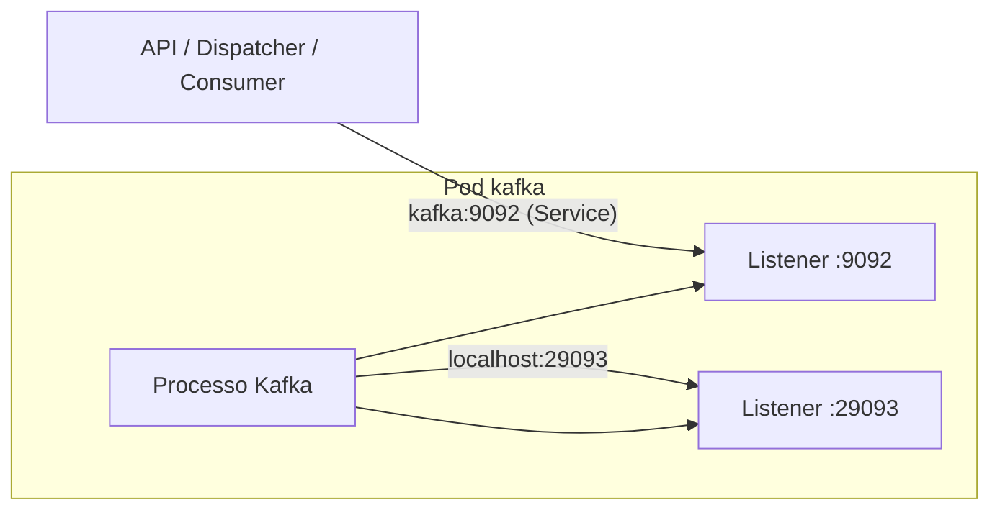
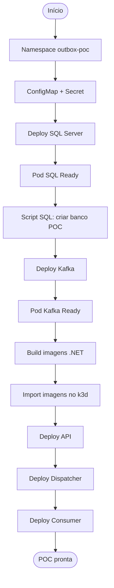

# Arquitetura, Infraestrutura e Comunicação

Documentação de referência para entender o padrão Transactional Outbox, a arquitetura hexagonal, a infraestrutura (Kubernetes/k3d) e como todos os componentes se comunicam.

---

## 1. Visão geral

| Conceito | Descrição |
|----------|-----------|
| **Transactional Outbox** | Padrão que garante publicação eventual de eventos: a API grava domínio + Outbox na **mesma transação**; um worker assíncrono lê a Outbox e publica no barramento (Kafka). Evita publicar antes de persistir ou perder eventos. |
| **Arquitetura Hexagonal** | Domain no centro; Application (casos de uso, portas); Infra (adapters: EF Core, Kafka); Hosts (API, Workers) orquestram e injetam dependências. |
| **k3d** | Kubernetes “dentro do Docker”: um cluster real rodando em containers, útil para POC e testes locais. |
| **KRaft** | Modo do Kafka sem Zookeeper (Apache Kafka 3.x+): um nó pode ser broker + controller. |

---

## 2. Arquitetura de componentes (hexagonal)

---

## 3. Fluxo Transactional Outbox (sequência)

```mermaid
sequenceDiagram
    participant Cliente
    participant API as POC.Api
    participant Handler as CreateInitializationHandler
    participant Repo as IInitializationRepository
    participant OutboxW as IOutboxWriter
    participant UoW as IUnitOfWork
    participant DB as SQL Server
    participant Dispatcher as Worker.Dispatcher
    participant Kafka
    participant Consumer as Worker.Consumer

    Cliente->>+API: POST /initializations { externalId }
    API->>+Handler: HandleAsync(command)
    Handler->>Repo: AddAsync(Initialization)
    Handler->>OutboxW: WriteAsync(InitializationCreatedEvent)
    Note over Handler,UoW: Nenhum commit ainda
    Handler->>UoW: SaveChangesAsync()
    UoW->>DB: BEGIN&#59; INSERT Initializations&#59; INSERT Outbox&#59; COMMIT
    Handler-->>-API: result
    API-->>-Cliente: 201 Created

    loop Poll (ex.: a cada 5s)
        Dispatcher->>DB: SELECT Outbox WHERE ProcessedAt IS NULL
        Dispatcher->>DB: UPDATE Outbox SET LockedUntil, LockId (lock)
        Dispatcher->>Kafka: Produce(tópico, key=AggregateId, payload)
        Dispatcher->>DB: UPDATE Outbox SET ProcessedAt (unlock)
    end

    Kafka->>Consumer: Consume(tópico, group poc-consumer)
    Consumer->>DB: INSERT ReceivedEvents (opcional)
    Consumer->>Kafka: Commit offset
```

---

## 4. Modelo de dados (persistência)

---

## 5. Infraestrutura no Kubernetes (k3d)

### 5.1 Topologia de deploy

### 5.2 Resolução de nomes e comunicação interna

Dentro do cluster, os pods **não** usam IPs fixos; usam o **nome do Service** como DNS:

| De quem      | Para quem   | Endereço usado                    | Origem da config        |
|-------------|-------------|------------------------------------|--------------------------|
| API         | SQL Server  | `sql-server:1433`                  | ConfigMap `ConnectionStrings__Default` |
| Dispatcher  | SQL Server  | `sql-server:1433`                  | idem                     |
| Dispatcher  | Kafka       | `kafka:9092`                       | ConfigMap `Kafka__BootstrapServers`    |
| Consumer    | Kafka       | `kafka:9092`                       | idem                     |
| Consumer    | SQL Server  | `sql-server:1433`                  | ConfigMap                |

O Kubernetes resolve `sql-server` e `kafka` para o **ClusterIP** do Service, que encaminha para um pod saudável (Ready). O DNS completo no cluster é `sql-server.outbox-poc.svc.cluster.local` (no mesmo namespace basta `sql-server`).

---

## 6. Configuração injetada (ConfigMap)

Todas as apps (API, Dispatcher, Consumer) recebem as mesmas variáveis de ambiente via **ConfigMap** `outbox-poc-config`, montado com `envFrom`:

Chaves relevantes:

| Chave (env)                     | Uso |
|--------------------------------|-----|
| `ConnectionStrings__Default`   | Connection string do SQL; lida como `ConnectionStrings:Default` no .NET (e sobrescreve appsettings). |
| `Sql__ConnectionString`        | Alternativa; lida como `Sql:ConnectionString`. |
| `Kafka__BootstrapServers`      | Broker Kafka; lido como `Kafka:BootstrapServers`. |
| `Kafka__TopicInitializationCreated` | Tópico (ex.: `poc.initialization.created`). |
| `Kafka__ConsumerGroup`        | Consumer group (ex.: `poc-consumer`). |
| `Dispatcher__PollIntervalSeconds`, `BatchSize`, `LockDurationSeconds` | Controle do Worker.Dispatcher. |
| `ASPNETCORE_URLS`              | Porta em que a API escuta no container (ex.: `http://+:80`). |

---

## 7. SQL Server: aceitar conexões de outros pods

O SQL Server no Linux (container) por padrão pode escutar só em `127.0.0.1`. Para outros pods (e para port-forward) conectarem, ele precisa escutar em **todas as interfaces**:

- **Arquivo:** `mssql.conf` (ConfigMap `sql-server-mssql-conf`).
- **Conteúdo:** `[network]` + `tcpiplistener = 0.0.0.0` + `port = 1433`.
- **Montagem:** no deployment, o ConfigMap é montado em `/var/opt/mssql/mssql.conf` (subPath).

Assim, o Service `sql-server:1433` encaminha para o pod e o processo SQL aceita a conexão. Do **host** (SSMS), usa-se **port-forward** `21433:1433` e conexão em **127.0.0.1,21433**.

---

## 8. Kafka: listeners, advertised e KRaft

### 8.1 Papel de cada configuração

| Configuração                 | Função |
|-----------------------------|--------|
| **KAFKA_LISTENERS**         | Interfaces/portas em que o broker **escuta** (ex.: `PLAINTEXT://:9092`). |
| **KAFKA_ADVERTISED_LISTENERS** | Endereço que o broker **anuncia** aos clientes (metadata). Os clientes usam esse endereço para conectar. |
| **KAFKA_CONTROLLER_QUORUM_VOTERS** | Em KRaft, lista de controllers (ex.: `1@host:port`). No single-node, broker e controller são o mesmo processo. |

No cluster, os clientes (API, Dispatcher, Consumer) conectam em `kafka:9092` (Service). O broker anuncia `kafka.outbox-poc.svc.cluster.local:9092`; como o DNS do Service resolve para o mesmo destino, a conexão funciona.

### 8.2 Single-node KRaft e “hairpin”

Em um único nó KRaft, o **mesmo processo** é broker e controller. O broker precisa falar com o controller; se esse endereço for o **Service** (`kafka.outbox-poc.svc.cluster.local:29093`), o tráfego seria **pod → Service → mesmo pod** (hairpin). Em muitos ambientes (ex.: k3d) o hairpin falha. Por isso, no single-node usamos **localhost** para o controller:

- **KAFKA_CONTROLLER_QUORUM_VOTERS:** `1@localhost:29093`

Assim, broker e controller conversam dentro do próprio container, sem passar pelo Service.

---

## 9. Exposição para o host (portas)

| Recurso      | Dentro do cluster              | No host (acesso) |
|-------------|---------------------------------|-------------------|
| **API**     | Service `poc-api:80`             | LoadBalancer k3d **28080** → `http://localhost:28080` (Swagger, health). |
| **SQL**     | Service `sql-server:1433`        | **Port-forward** `21433:1433` → SSMS/sqlcmd em **127.0.0.1,21433**. |
| **Kafka**   | Service `kafka:9092`             | Port-forward `9092:9092` → apps no host com `BootstrapServers=localhost:9092`. |
| **Kafka UI**| Service `kafka-ui:8080`          | Port-forward `8081:8080` → `http://localhost:8081`. |
| **Dashboard** | Service `kubernetes-dashboard:443` | Port-forward `8443:443` → `https://localhost:8443` (login com token). |

A **única** porta exposta automaticamente pelo k3d para a API é a do LoadBalancer (28080). Os demais acessos do host usam **port-forward** explícito.

---

## 10. Ordem de subida e dependências

1. **Namespace + ConfigMap + Secret** — config e senha do SQL disponíveis.
2. **SQL Server** — sobe primeiro; demora ~2–3 min para ficar Ready (probes em 1433).
3. **Script SQL** — cria banco `POC` e tabelas (Initializations, Outbox, ReceivedEvents, etc.); obrigatório antes das apps.
4. **Kafka** — sobe em seguida; startupProbe dá até ~5 min para abrir a porta 9092.
5. **Build + import** — imagens Docker da API e dos Workers; import no cluster k3d.
6. **Deploy API + Workers** — leem ConfigMap (SQL e Kafka já devem estar acessíveis).

---

## 11. Resumo da matriz de comunicação

| Origem       | Destino   | Protocolo/porta | Configuração |
|-------------|-----------|------------------|--------------|
| Cliente HTTP | API       | HTTP :28080 (host) ou :80 (pod) | LoadBalancer / Service |
| API         | SQL Server | TCP 1433        | `ConnectionStrings__Default` → `sql-server,1433` |
| API         | Kafka     | —                | API **não** publica no Kafka; só grava na Outbox. |
| Dispatcher  | SQL Server | TCP 1433        | idem ConfigMap |
| Dispatcher  | Kafka     | TCP 9092        | `Kafka__BootstrapServers` → `kafka:9092` |
| Consumer    | Kafka     | TCP 9092        | idem |
| Consumer    | SQL Server | TCP 1433        | idem (ReceivedEvents) |
| Host (SSMS) | SQL       | TCP 21433 (host) | port-forward + 127.0.0.1,21433 |
| Host (browser) | API    | HTTP 28080       | LoadBalancer |

Esta documentação deve ser lida em conjunto com o **README.md** (passo a passo) e o **scripts/access-guide.ps1** (comandos e portas dinâmicos).
